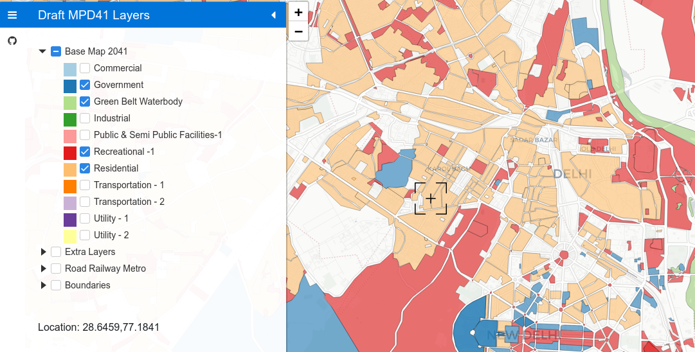

# dratfmpd41.github.io

A volunteers-setup map to show layers of MPD41 : Draft 2041 development plan of Delhi, India

Deployed as a static site on gihub pages.

Initiative and initial data extraction by: [Rajesvari Parasa](https://github.com/rajesvariparasa)

Coding by: [Nikhil VJ](https://nikhilvj.co.in) on behalf of Kaisyn Consultancy and Training Pvt Ltd

## Make it yours
- All the defaults are in **config.js** at the top.
- The layers listing, grouping and colors are decided by a **map_layers.csv** in config/ folder.
- Shapefiles are in data/ folder. Their exact filenames should be put in map_layers.csv .

## Deploy locally
- Easiest way if you have python3 working: Open command line at the folder and `python3 -m http.server` then open http://localhost:8000 in your browser.
- If there's an apache or nginx server installed, drop the folder in their www / htdocs path or so.
- For windows, search for "portable web server" - there's a lot of solutions.

## Ref Articles: 
- https://twitter.com/mbd2041/status/1348156082019913729
- https://timesofindia.indiatimes.com/city/delhi/80-in-survey-say-no-clue-about-ddas-masterplan/articleshow/80193521.cms
- https://igsss.org/wp-content/uploads/2020/12/Assessment-of-Peoples-Awareness-on-Delhi-Master-Plan-2021-41-1.pdf

